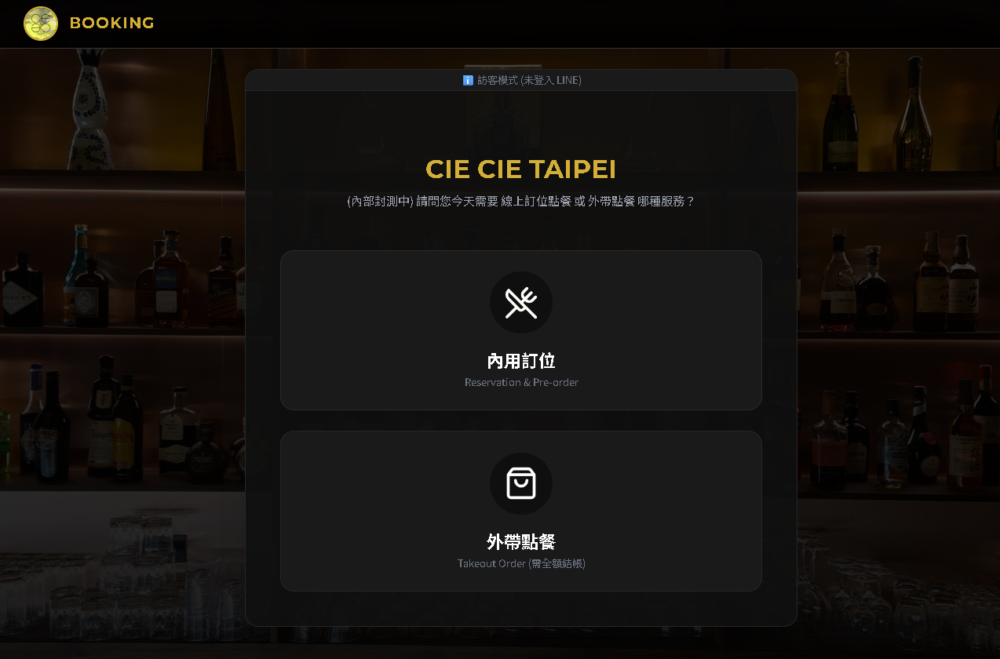
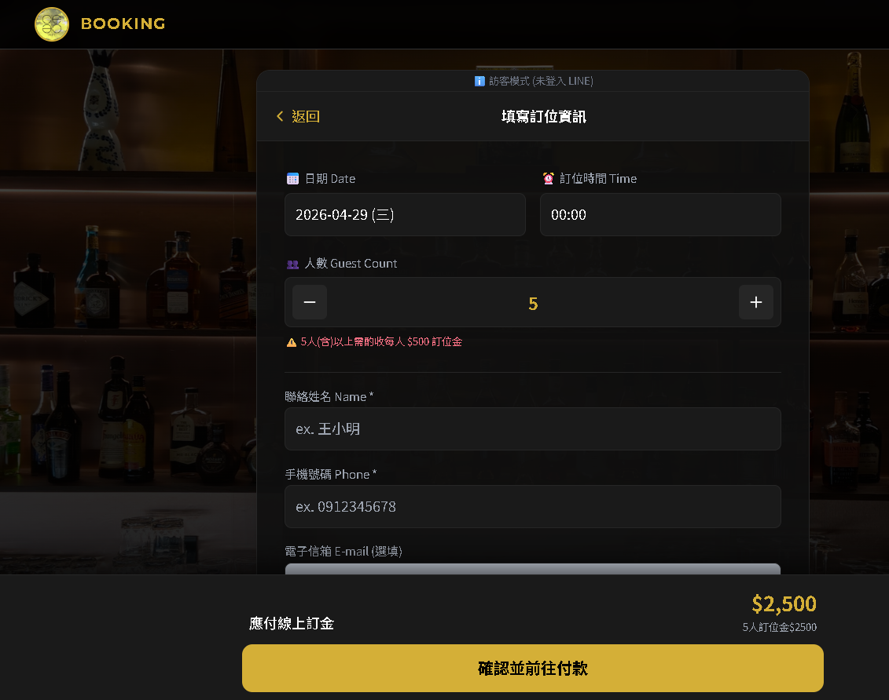
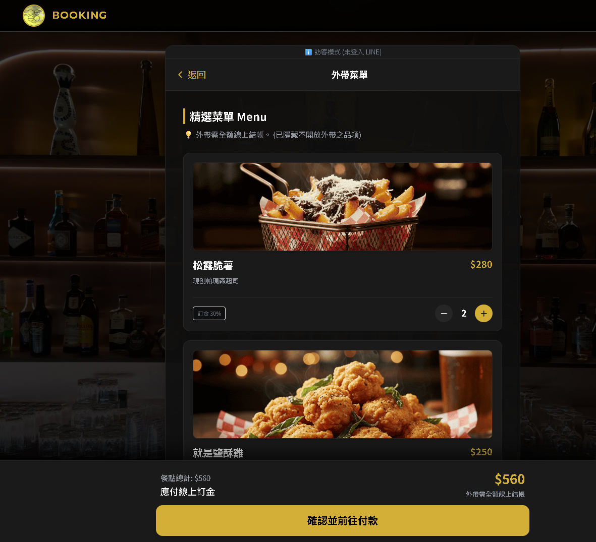
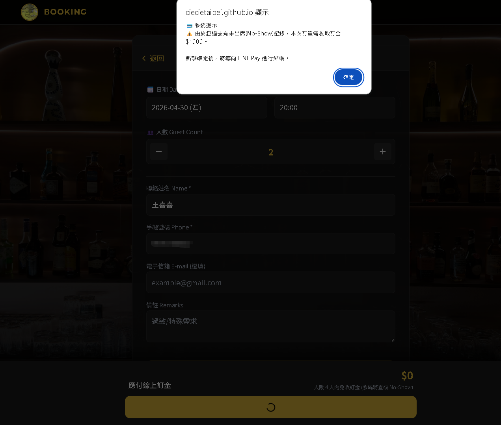
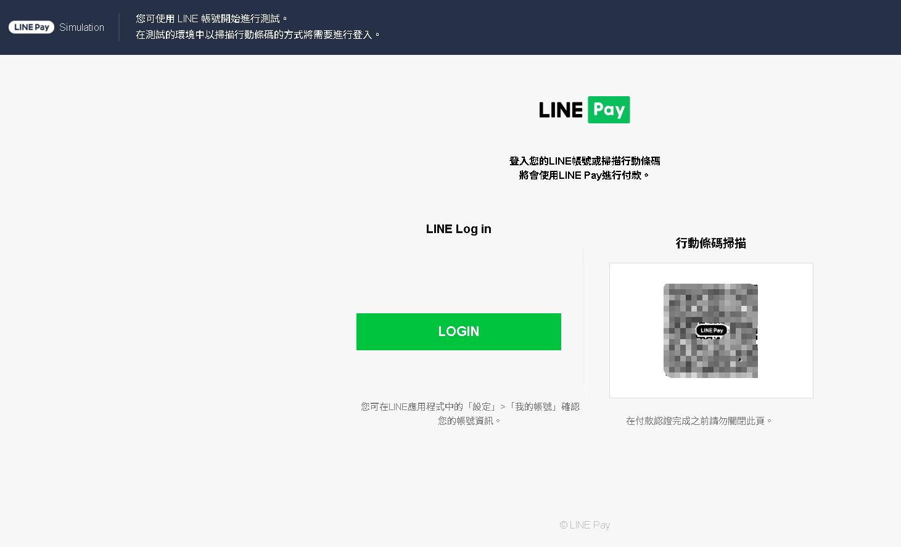
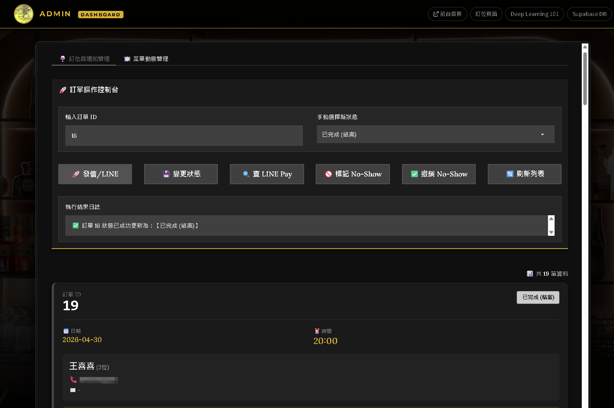
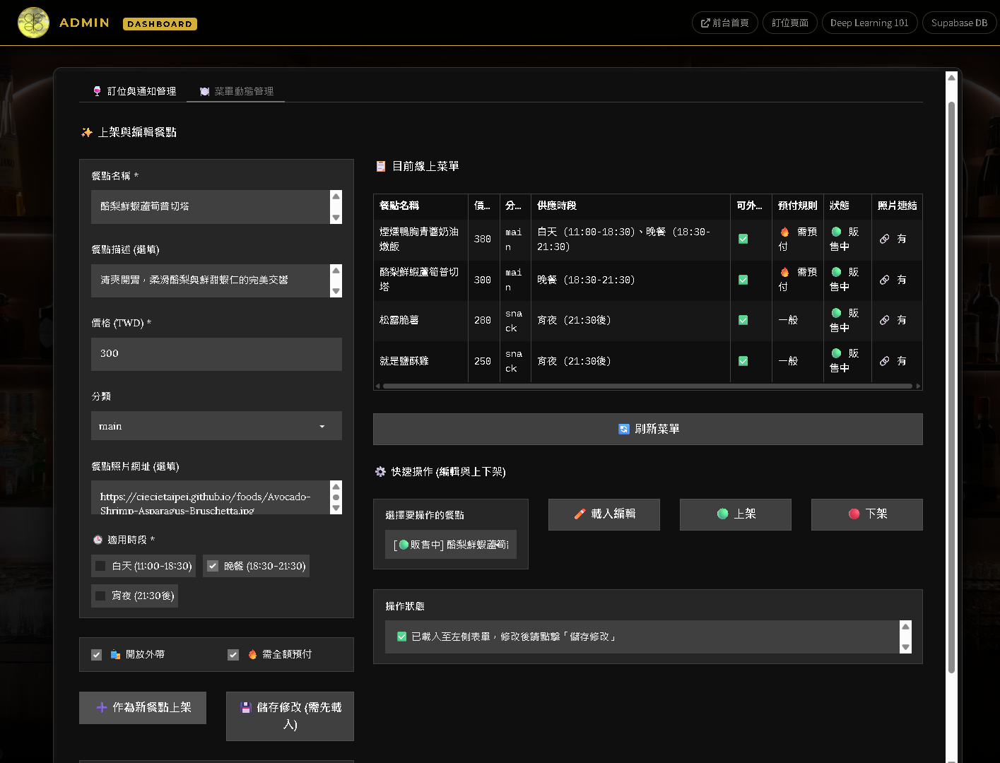

# [CIE CIE TAIPEI](https://ciecietaipei.github.io/)

  

### 我們將愜意帶進台北，柔和的光線，極簡的陳設，時間彷彿慢了下來。  
### 我們提供多樣化暖心餐點、微醺精選酒水繚繞，讓你在充滿設計感的空間中，享受愜意放鬆的用餐體驗，
### 這裡能讓您的每個感官都獲得滿足，準備好來 CIE CIE TAIPEI 享受美好夜晚了嗎？  

# 📍 地址：[台北市大安區信義路四段390號](https://maps.app.goo.gl/Nmh4xbvaxhVPRcJU9)
# ⏰ 營業時間：18:30 – 02:00（週五六至 03:00）
# 🥂 [立即線上 訂位點餐 / 外帶點餐](https://ciecietaipei.github.io/booking.html)
# ☎️ 02-27093446

    

# 👑 CIE CIE TAIPEI 網站 AI 餐飲暨訂位管理系統 ─ 白皮書

> **System Architecture & Feature Overview (系統架構與功能總覽)**

## 🏗️ 系統三大核心架構說明

兼顧「極致的網頁載入速度」、「絕對的資安防護」以及「零維護成本」，採用現代化分離式雲端架構
**「客製化前台」**（客人用的）、**「隱形安管大腦」**（雲端伺服器）、以及 **「老闆戰情室」**（後台管理）。

## 第一部分：**🌅 客製化前台黃金店面 (GitHub Pages)** (顧客端流暢的點餐與訂位體驗網頁)  

**核心價值：提供極致順暢的預約與點餐體驗，同時在第一線做好營運防護。**

  * **任務**：承載客人的視覺體驗與操作介面  
    * [index.html](https://ciecietaipei.github.io/index.html)  
    * [booking.html](https://ciecietaipei.github.io/booking.html)  
    * [foods.html](https://ciecietaipei.github.io/foods.html)  
    * [drinks.html](https://ciecietaipei.github.io/drinks.html)  
    * [environment.html](https://ciecietaipei.github.io/environment.html)  

   * **優勢**：全球 CDN 加速、永遠在線、完全免費，且網頁原始碼中不包含任何機密金鑰，安全性極高。  

1. **智慧分流與時段控管 「第一步：選擇服務 (內用/外帶) 的大按鈕畫面」**  
   * **功能說明**：系統會自動根據客人選擇「內用」或「外帶」，切換不同的營業時間限制。系統會自動過濾掉已過期的時間，並根據時段（白天、晚餐、宵夜）自動顯示對應的菜單。

  

2. **防護型購物車與訂金自動計算 「動態訂金試算引擎」**
   * **功能說明**：系統內建複雜的商業邏輯。
    * 5人(含)以上訂位，自動加收 $500/人 訂位金。  
    * 外帶餐點，自動計算為 100% 全額結帳。  
    * 內用若點選高價食材，按比例或全額收取預付金。

  
    

3. **無縫接軌的 LINE Pay 體驗**
   * **功能說明**：確認訂單後，系統直接喚醒 LINE Pay 進行結帳，結帳完成後自動跳轉回官網並顯示成功動畫。

---

## 第二部分：**🧠 隱密智慧大腦與後台 (Hugging Face Spaces)**  (FastAPI 雲端核心)  

**核心價值：24 小時不休息的數位保鑣與收銀員，確保資料安全與金流準確。**

  * **任務**：運行 FastAPI 金流大腦與 Gradio 後台管理介面。  

  * **優勢**：作為「守門員」，負責在背景計算訂金、向 LINE Pay 申請收款連結、查核黑名單，並提供老闆專屬的視覺化管理介面，確保敏感邏輯不外流。  

1. **No-Show (放鳥) 黑名單自動攔截**  
  * **功能說明**：當客人按下送出時，大腦會瞬間去資料庫比對電話號碼。一旦發現是曾被老闆標記過「No-Show」的慣犯，即使他只訂 2 個人，系統也會**強制啟動防護機制，要求預付 $1000 訂金**，否則不予訂位。

  

2. **軍規級金流加密與自動對帳**

   * **功能說明**：每一筆 LINE Pay 交易都經過嚴格的 HMAC-SHA256 簽章加密，防止駭客竄改金額。付錢後自動將狀態改為「已付訂金」並通知老闆。

  

---

## 第三部分：**🏦 雲端加密資料庫 (Supabase)** 老闆戰情室 (Admin 後台管理系統)

**核心價值：將複雜的營運數據化繁為簡，用手機或平板就能掌控全店狀況。**

  * **任務**：安全儲存訂單、菜單、顧客 No-Show 紀錄。  

  * **優勢**：銀行級別的加密防護，並提供強大的資料即時讀寫能力。  

1. **視覺化訂單管理卡片**

   * **功能說明**：捨棄傳統難讀的 Excel 表格，將每一筆訂單化為精美的「戰情卡片」。顏色標籤一目瞭然（綠色已確認、藍色待付款、紅色已取消/黑名單）。

  

2. **一鍵查帳與補繳機制 (拯救流失訂單)**

   * **功能說明**：客人說他付了但系統沒顯示？老闆只需輸入訂單 ID 點擊「🔍 查 LINE Pay」，系統直接連線總部對帳。若客人忘記付款，點擊「🚀 發信/LINE」，系統會自動把專屬的「補繳費連結」寄給客人。

3. **免寫程式的「動態菜單」管理**

   * **功能說明**：換季換菜單、某道菜突然賣完？老闆隨時可以在後台新增餐點、設定價格、限制供應時段（例如宵夜限定），或是**「一鍵下架」**。前台顧客的手機畫面會在一秒內同步更新。

  

### 一、 系統四大節點如何完美協作？(全景架構補充)

1.  **`booking.html` (前台/顧客端)**：

    這是系統的**「感測器與防線」**。它不僅負責把畫面渲染得漂亮，更重要的是，它在客人的手機上執行**「第一道防呆」**。例如：阻擋客人把 $0 元醬料點得比主餐還多、即時變灰並鎖死已經賣完（限量剩 0 份）的餐點。它負責把整理好的「乾淨訂單」發送給 API 大腦。

2.  **`api_space.py` (FastAPI 大腦/核心端)**：

    這是系統的**「隱形心臟與出納」**。所有最危險的動作都在這裡進行。它握有 LINE Pay 的最高機密金鑰，負責跟 LINE 總部連線生成付款網址。它也是**「背景救援精靈」**的家，當客人中途關閉網頁時，它會在背景倒數 3 分鐘，然後自動幫您把錢請款收回來。

3.  **`admin_space.py` (Gradio 後台/老闆端)**：

    這是系統的**「遙控器」**。它本身不處理複雜的客製化邏輯，而是直接對「資料庫」下達指令。當您在後台設定了一道菜的「每日限量」是 5 份，或者將價格改為 $0，這些改變會立刻存入資料庫，而前台下一次讀取時就會瞬間生效。

4.  **Supabase (資料庫/雲端金庫)**：

    系統的**「記憶體」**。前台負責讀取菜單，大腦負責寫入訂單，後台負責修改菜單與訂單狀態，全部都匯集在這裡。

---

### 二、 掃雷大作戰 ─ 我們陸續解決了哪些「隱藏地雷」？

這些是在開發餐飲系統時，只有親自下水才會遇到的痛點，我們都已經一一破解了：

*   **💣 $0 元餐點與免費防貪機制**：

    *   **問題**：系統原本的防呆機制會把 `$0` 視為「沒填寫價格」，導致無法上架免費醬料；且若不限制，客人可以無限加點免錢商品。

    *   **解法**：在後台將防呆改為 `price is None`，解鎖 $0 元上架能力。並在前端購物車（`booking.html`）植入邏輯：`免費商品數量 必須小於 主餐數量`，完美引導客人點餐又不怕被佔便宜。

*   **💣 幽靈掉單 (Drop-off) 的終極救援**：

    *   **問題**：客人付完款看到「授權成功」就急著關閉網頁，導致系統來不及執行「Confirm (請款)」，錢卡在半空中。

    *   **解法**：在 FastAPI 大腦中導入 `BackgroundTasks`。每當客人前往結帳，系統就派出一隻「倒數 3 分鐘」的背景精靈。時間一到，若發現客人沒回來，精靈會自動向 LINE Pay 執行請款，並發送「🌟 救援成功」的特殊 LINE 通知給老闆。

*   **💣 舊資料空值 (None) 引發的系統崩潰 (Server 500)**：

    *   **問題**：當我們為資料庫新增了「每日限量 (`daily_limit`)」欄位時，舊的餐點這個欄位是空的。若前端或後台直接拿空值去計算（例如：減法或比大小），會導致整個網頁當機。

    *   **解法**：在前後端都加入了嚴格的 `is not None` 與型別轉換防護，確保遇到空值時一律視為無限量供應（`999`），讓系統穩如泰山。

*   **💣 動態庫存計算 (每日限量)**：

    *   **問題**：傳統庫存扣到 0 就沒了，無法應付「預約明天」的訂單。

    *   **解法**：我們不扣總庫存。而是讓前端透過 API 即時詢問大腦：「這一天，這道菜已經被買走幾份了？」，然後拿 `每日限量 - 當日銷量 = 剩餘份數`，實現了完美的日動態庫存。

---

### 三、 LINE Pay 到底怎麼串接？怎樣才算「真付款」？

LINE Pay 的串接邏輯是嚴格的「兩段式驗證」：

1.  **Request (請求)**：大腦跟 LINE Pay 說「我要收 1000 元」，LINE Pay 給一個結帳網址。

2.  **Authorize (授權)**：客人在綠色畫面上輸入密碼。此時錢**還沒進您的口袋**，只是被圈存起來。

3.  **Confirm (請款)**：這是**最重要的一步**！網頁必須跳轉回來，讓大腦拿著交易序號再去跟 LINE Pay 說一次：「我確認要收這筆錢！」。**這時候，錢才算真正入帳。**

**如何從 Sandbox 切換到正式上線？**

您完全不需要改程式碼邏輯，只需要去 Hugging Face (大腦的 Space) 的 `Settings -> Variables and secrets` 裡，把這三個值換掉：

*   `LINE_PAY_CHANNEL_ID`：換成正式版的 ID。

*   `LINE_PAY_CHANNEL_SECRET`：換成正式版的密鑰。

*   `LINE_PAY_BASE_URL`：將 `[https://sandbox-api-pay.line.me](https://sandbox-api-pay.line.me)` 改為正式版的網址 `[https://api-pay.line.me](https://api-pay.line.me)`。

---

### 四、 關於「老闆的 LINE 通知」與沙盒測試疑雲

**「我在 Sandbox 測試時，到底會不會收到 LINE 通知？」**

**答案是：絕對會！而且應該要收到。**

**原理釋疑：**

「LINE Pay 沙盒（虛擬扣款）」和「LINE Messaging API（發送推播給老闆）」是兩個**完全分開**的系統。只要您的 `main.py` 成功執行到最後一步，它就會用真實的 LINE Bot 去敲老闆真實的 LINE 帳號。

**如果您在測試時沒收到通知，通常是以下 3 個原因：**

1.  **您沒等網頁跳轉回來**：如果您在綠色的 LINE Pay 畫面付完錢就直接關掉，系統沒有觸發剛剛說的「Confirm (請款)」，所以也不會觸發接下來的「發通知給老闆」指令。（不過現在我們有了「背景救援精靈」，就算您關掉網頁，**3 分鐘後**精靈還是會幫您請款並補發一則通知給您！）

2.  **老闆的 LINE ID (`BOSS_LINE_ID`) 填錯了**：這必須是一長串以 `U` 開頭的英數字（User ID），不能是您的 LINE 顯示名稱或手動設定的 ID。

3.  **老闆還沒加機器人為好友**：您的私人 LINE 帳號，必須先去加您申請的那個 LINE Official Account (LINE Bot) 為好友，機器人才有權限主動發訊息給您。

您可以試著在 Sandbox 完整跑一次流程：選餐 ➔ 結帳 ➔ 等待跳轉回 `booking.html` 看到大大的綠色打勾 ✅。這時候，您的手機絕對會「叮咚」響起！